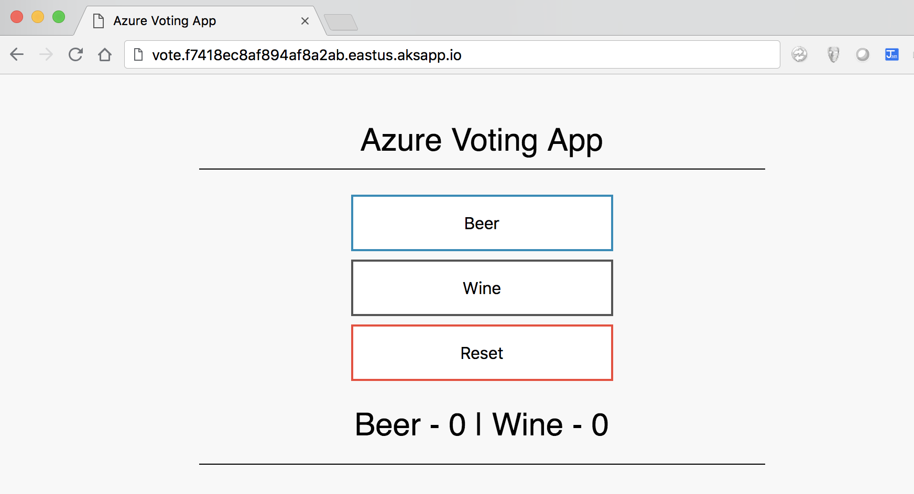

# Module AKS104: Setup Ingress Controllers


An ingress controller is a piece of software that provides reverse proxy, configurable traffic routing, and TLS termination for Kubernetes services. Kubernetes ingress resources are used to configure the ingress rules and routes for individual Kubernetes services. Using an ingress controller and ingress rules, a single IP address can be used to route traffic to multiple services in a Kubernetes cluster.

## Setup HTTP Application Routing
  

The HTTP application routing solution makes it easy to access applications that are deployed to your Azure Kubernetes Service (AKS) cluster. it configures an Ingress controller in your AKS cluster. As applications are deployed, the solution also creates publically accessible DNS names for application endpoints (it actually creates a DNS Zone in your subscription). In creating AKS cluster in the [aks-101 module](aks-101-create-aks-cluster.md), you already enabled the `HTTP application routing solution`. So you're ready to use the HTTP application routing. For more on HTTP application routing, please refer to [this](https://docs.microsoft.com/en-us/azure/aks/http-application-routing).


In this module, you configure the HTTP application routing which has been already deployed in an Azure Kubernetes Service (AKS) cluster, and make your app accessible via the the HTTP application routing.

### Change the application's service type from LoadBalancer to ClusterIP


At this point, you can access the application endpoint with Global IP thanks to `LoadBalancer` that you've configured as the service type in `kubernetes-manifests/vote/service.yaml`. Here, you change the service type from `LoadBalancer` to `ClusterIP`. By changing the type to `ClousterIP`, you no longer can access the endpoint with Global IP but you can access within the cluster. 


Open `kubernetes-manifests/vote/service.yaml` and change the service type from `LoadBalancer` to `ClusterIP`:

```
apiVersion: v1
kind: Service
metadata:
  name: azure-voting-app-back
  labels:
    app: azure-voting-app
spec:
  ports:
  - port: 3306
  selector:
    app: azure-voting-app
    component: azure-voting-app-back
---
apiVersion: v1
kind: Service
metadata:
  name: azure-voting-app-front
  labels:
    app: azure-voting-app
spec:
  type: ClusterIP                                     <<<< Changed from LoadBalancer to ClusterIP
  ports:
  - port: 80
  selector:
    app: azure-voting-app
    component: azure-voting-app-front
```

Then, re-deploy it using `kubectl apply`

```sh
$ kubectl apply -f kubernetes-manifests/vote/service.yaml

service "azure-vote-back" created
service "azure-vote-front" created
```

Check if `azure-vote-front` no longer have `EXTERNAL-IP` but only have `CLUSTER-IP`

```sh
$kubectl get svc -w

NAME               TYPE        CLUSTER-IP     EXTERNAL-IP   PORT(S)    AGE
azure-vote-back    ClusterIP   10.0.155.155   <none>        3306/TCP   2m
azure-vote-front   ClusterIP   10.0.118.224   <none>        80/TCP     2m
kubernetes         ClusterIP   10.0.0.1       <none>        443/TCP    10d
```

#### [Alternative Way to edit the service] - Directly edit the service by "kubeclt edit svc"

First of all, get the service name for the front app
```sh
$ kubectl get svc

NAME                     TYPE           CLUSTER-IP    EXTERNAL-IP   PORT(S)        AGE
azure-voting-app-back    ClusterIP      10.0.129.1    <none>        3306/TCP       57m
azure-voting-app-front   LoadBalancer   10.0.20.143   13.78.11.43   80:30506/TCP   57m
kubernetes               ClusterIP      10.0.0.1      <none>        443/TCP        18h
```

Then, edit the services and change the service type from `LoadBalancer` to `ClusterIP`:
```sh
$ kubectl edit svc azure-voting-app-front
```
```yaml
apiVersion: v1
kind: Service
metadata:
  ...
spec:
  clusterIP: 10.0.20.143
  externalTrafficPolicy: Cluster
  ports:
  - nodePort: 30506                     <<<< remove nodePort line
    port: 80
    protocol: TCP
    targetPort: 80
  selector:
    app: azure-voting-app
    component: azure-voting-app-front
  sessionAffinity: None
  type: LoadBalancer                    <<<< Change from LoadBalancer to ClusterIP
status:
  ...
```

After your modification, it should be like this:
```yaml
apiVersion: v1
kind: Service
metadata:
  ...
spec:
  clusterIP: 10.0.20.143
  externalTrafficPolicy: Cluster
  ports:
  - port: 80
    protocol: TCP
    targetPort: 80
  selector:
    app: azure-voting-app
    component: azure-voting-app-front
  sessionAffinity: None
  type: ClusterIP
status:
  ...
```


### Create ingress resource

Browse to the auto-created AKS resource group named `MC_<ResourceGroup>_<ClusterName>_<region>` and select the DNS zone. Take note of the DNS zone name. This name is needed in next strep.


Then, open `kubernetes-manifests/vote/ingress.yaml` and replace `<CLUSTER_SPECIFIC_DNS_ZONE>` with the DNS zone that you obtained

```yaml
apiVersion: extensions/v1beta1
kind: Ingress
metadata:
  name: azure-voting-app
  labels:
    app: azure-voting-app
  annotations:
    kubernetes.io/ingress.class: addon-http-application-routing
spec:
  rules:
  - host: vote.<CLUSTER_SPECIFIC_DNS_ZONE>
    http:
      paths:
      - backend:
          serviceName: azure-voting-app-front
          servicePort: 80
        path: /
```

Then, deploy the ingress

```sh
$ kubectl apply -f kubernetes-manifests/vote/ingress.yaml

ingress.extensions/azure-voting-app created
```

Check if the ingress is actually created
```sh
$ kubectl get ingress -w

NAME           HOSTS                                                   ADDRESS   PORTS     AGE
azure-vote     vote.f7418ec8af894af8a2ab.eastus.aksapp.io                     80        1m
```

Finally, you can access the app with the URL - `http://vote.<CLUSTER_SPECIFIC_DNS_ZONE>`




## (Optional) Setup NGINX Ingress Controller 

This is optional. In this section, you deploy the NGINX ingress controller in your AKS cluster and make your app accessible via the the Ingress controller.

- https://docs.microsoft.com/ja-jp/azure/aks/ingress-basic

## (Optional) Setup Application Gateway Ingress Controller

This is optional. In this section, you deploy the Application Gateway Ingress controller in your AKS cluster and make your app accessible via the the Ingress controller.

- https://github.com/Azure/application-gateway-kubernetes-ingress


---
[Top](../README.md) | [Back](aks-103-deploy-app.md) | [Next](aks-105-scaleout.md)
