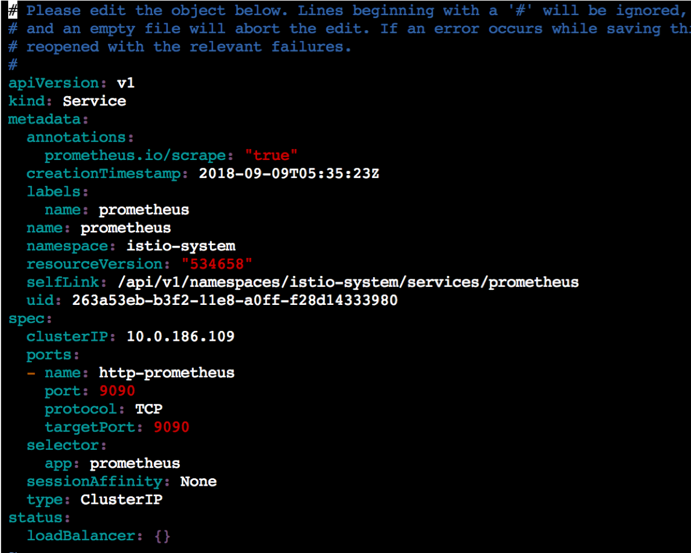

# Istio01: Setup Istio

<!-- TOC -->
- [Istio01: Setup Istio](#istio01-setup-istio)
  - [Download Istio release package](#download-istio-release-package)
  - [Install Istio Core Components](#install-istio-core-components)
    - [Install Istio with Helm and Tiller via helm install](#install-istio-with-helm-and-tiller-via-helm-install)
    - [Verifying the installation](#verifying-the-installation)
  - [Access Istio endpoints (Forwarding local ports to a Pod.)](#access-istio-endpoints-forwarding-local-ports-to-a-pod)
  - [Expose and access Istio endpoints (if you can't access the Istio endpoint by forwarding local ports to a Pod)](#expose-and-access-istio-endpoints-if-you-cant-access-the-istio-endpoint-by-forwarding-local-ports-to-a-pod)


## Download Istio release package

In this lab, we use `istio-1.1.3`. Run the following command to download `istio-1.1.3` package

```sh
$ curl -L https://raw.githubusercontent.com/yokawasa/azure-container-labs/master/scripts/istio-helpers/get-istio | sh -
```
> [NOTE] If you want to download the latest Istio, run the following:
> ```sh
> curl -L https://git.io/getLatestIstio | sh -
> ```

Once you download the package, change directory to istio-1.X.X
```sh
cd istio-1.X.X
```
## Install Istio Core Components

Install Istio's core components with Helm and Tiller via helm install

> Please see [Istio - Installation Options](https://istio.io/docs/reference/config/installation-options/) for more details on what options can be added. 

### Install Istio with Helm and Tiller via helm install

For a production setup of Istio, it's recommended to install with the Helm Chart, to use all the configuration options.


Make sure you have a service account with the cluster-admin role defined for Tiller. If not already defined, create one using following command:
```
kubectl apply -f install/kubernetes/helm/helm-service-account.yaml
```

Install Tiller on your cluster with the service account:
```
helm init --service-account tiller

# Check Helm version
helm version

Client: &version.Version{SemVer:"v2.13.0", GitCommit:"79d07943b03aea2b76c12644b4b54733bc5958d6", GitTreeState:"clean"}
Server: &version.Version{SemVer:"v2.13.0", GitCommit:"79d07943b03aea2b76c12644b4b54733bc5958d6", GitTreeState:"clean"}
```

Install the `istio-init` chart to bootstrap all the Istio’s CRDs:
```
helm install install/kubernetes/helm/istio-init --name istio-init --namespace istio-system
```

Verify that all `53` Istio CRDs were committed to the Kubernetes api-server using the following command:
```
kubectl get crds | grep 'istio.io\|certmanager.k8s.io' | wc -l

53
```

Then, install the istio `demo` profile chart

```sh
helm install install/kubernetes/helm/istio --name istio \
  --namespace istio-system \
  --values install/kubernetes/helm/istio/values-istio-demo.yaml
```

Expected output would be like this:
```
...
NOTES:
Thank you for installing istio.

Your release is named istio.

To get started running application with Istio, execute the following steps:
1. Label namespace that application object will be deployed to by the following command (take default namespace as an example)

$ kubectl label namespace default istio-injection=enabled
$ kubectl get namespace -L istio-injection

2. Deploy your applications

$ kubectl apply -f <your-application>.yaml

For more information on running Istio, visit:
```


> [NOTE] 
> Use `demo` profile as `prometheus` and `grafana` for viewing the metrics from Istio, and `Jaeger` for tracing, and `Kiali` for visualization are needed. But if they are not needed, it's recommended to install `default` profile.
 
See [Installation Configuration Profiles](https://istio.io/docs/setup/kubernetes/additional-setup/config-profiles/) for more detail on installation profile


### Verifying the installation

 verify that the Kubernetes services corresponding to your selected profile have been deployed.
```
kubectl get svc -n istio-system

NAME                     TYPE           CLUSTER-IP     EXTERNAL-IP   PORT(S)                                                                                                                                      AGE
grafana                  ClusterIP      10.0.187.94    <none>        3000/TCP                                                                                                                                     4m37s
istio-citadel            ClusterIP      10.0.42.3      <none>        8060/TCP,15014/TCP                                                                                                                           4m37s
istio-egressgateway      ClusterIP      10.0.122.176   <none>        80/TCP,443/TCP,15443/TCP                                                                                                                     4m37s
istio-galley             ClusterIP      10.0.95.88     <none>        443/TCP,15014/TCP,9901/TCP                                                                                                                   4m37s
istio-ingressgateway     LoadBalancer   10.0.91.124    13.73.31.60   15020:30211/TCP,80:31380/TCP,443:31390/TCP,31400:31400/TCP,15029:32234/TCP,15030:31342/TCP,15031:30919/TCP,15032:30785/TCP,15443:32407/TCP   4m37s
istio-pilot              ClusterIP      10.0.76.251    <none>        15010/TCP,15011/TCP,8080/TCP,15014/TCP                                                                                                       4m37s
istio-policy             ClusterIP      10.0.73.84     <none>        9091/TCP,15004/TCP,15014/TCP                                                                                                                 4m37s
istio-sidecar-injector   ClusterIP      10.0.237.107   <none>        443/TCP                                                                                                                                      4m37s
istio-telemetry          ClusterIP      10.0.10.94     <none>        9091/TCP,15004/TCP,15014/TCP,42422/TCP                                                                                                       4m37s
jaeger-agent             ClusterIP      None           <none>        5775/UDP,6831/UDP,6832/UDP                                                                                                                   4m37s
jaeger-collector         ClusterIP      10.0.194.216   <none>        14267/TCP,14268/TCP                                                                                                                          4m37s
jaeger-query             ClusterIP      10.0.254.223   <none>        16686/TCP                                                                                                                                    4m37s
kiali                    ClusterIP      10.0.100.212   <none>        20001/TCP                                                                                                                                    4m37s
prometheus               ClusterIP      10.0.231.200   <none>        9090/TCP                                                                                                                                     4m37s
tracing                  ClusterIP      10.0.7.50      <none>        80/TCP                                                                                                                                       4m37s
zipkin                   ClusterIP      10.0.72.110    <none>        9411/TCP                                                                                                                                     4m37s
```

Ensure the corresponding Kubernetes pods are deployed and have a STATUS of Running:

```
kubectl get pods -n istio-system

NAME                                     READY   STATUS      RESTARTS   AGE
grafana-c49f9df64-m47gk                  1/1     Running     0          4m58s
istio-citadel-7f699dc8c8-dt5hf           1/1     Running     0          4m58s
istio-egressgateway-54f556bc5c-x5r72     1/1     Running     0          4m58s
istio-galley-687664875b-hfqlp            1/1     Running     0          4m58s
istio-ingressgateway-688d5886d-jq9qp     1/1     Running     0          4m58s
istio-init-crd-10-7hdg4                  0/1     Completed   0          27m
istio-init-crd-11-t5gfz                  0/1     Completed   0          27m
istio-pilot-66964dfcd6-b5kwb             2/2     Running     0          4m58s
istio-policy-5bccd487c8-z9dtz            2/2     Running     4          4m58s
istio-sidecar-injector-d48786c5c-m2d2p   1/1     Running     0          4m57s
istio-telemetry-59794cc5b4-wxcxz         2/2     Running     3          4m58s
istio-tracing-79db5954f-vvhjk            1/1     Running     0          4m57s
kiali-5c4cdbb869-cvmf6                   1/1     Running     0          4m58s
prometheus-67599bf55b-9pzxz              1/1     Running     0          4m58s
```


## Access Istio endpoints (Forwarding local ports to a Pod.)

To port-forward and access `grafana`, run the following commands: 
```
kubectl -n istio-system port-forward $(kubectl -n istio-system get pod -l app=grafana \
  -o jsonpath='{.items[0].metadata.name}') 3000:3000

```
Open other browser, and access `localhost:3000`
```
open http://localhost:3000
```

To port-forward and access `prometheus`, run the following commands: 
```
kubectl -n istio-system port-forward \
  $(kubectl -n istio-system get pod -l app=prometheus -o jsonpath='{.items[0].metadata.name}') 9090:9090
```

Open other browser, and access `localhost:9000`
```
open http://localhost:9090
```

To port-forward and access `Jaeger`, run the follwoing commands:
```
kubectl port-forward -n istio-system $(kubectl get pod -n istio-system -l app=jaeger -o jsonpath='{.items[0].metadata.name}') 16686:16686
```

Open other browser, and access `localhost:16686`
```
open http://localhost:16686
```

To port-forward and access `Kiali`, run the follwoing commands (user:pass=`admin`:`admin` by default):
```
kubectl -n istio-system port-forward $(kubectl -n istio-system get pod -l app=kiali -o jsonpath='{.items[0].metadata.name}') 20001:20001
```

Open other browser, and access `localhost:20001`
```
open http://localhost:20001/kiali/
```


## Expose and access Istio endpoints (if you can't access the Istio endpoint by forwarding local ports to a Pod)

For example, if you are using `Azure Cloud Shell`, you can not use local portforward to access internal endpoints in Istio, you need to change the service type from `ClusterIP` to `LoadBalancer`. By changing the type to `LoadBalancer`, you can access the endpoint with Global IP. 

Edit the services and change the service type from `ClusterIP` to `LoadBalancer`:

```
# for Prometheus
kubectl -n istio-system edit svc prometheus

# for Grafana
kubectl -n istio-system edit svc grafana

# for Jaeger
kubectl -n istio-system edit svc jaeger-query

# for Kiali
kubectl -n istio-system edit svc kiali
```




---
[Istio Top](aks-202-istio-top.md)| [Next](istio-02-deploy-bookinfo.md)
