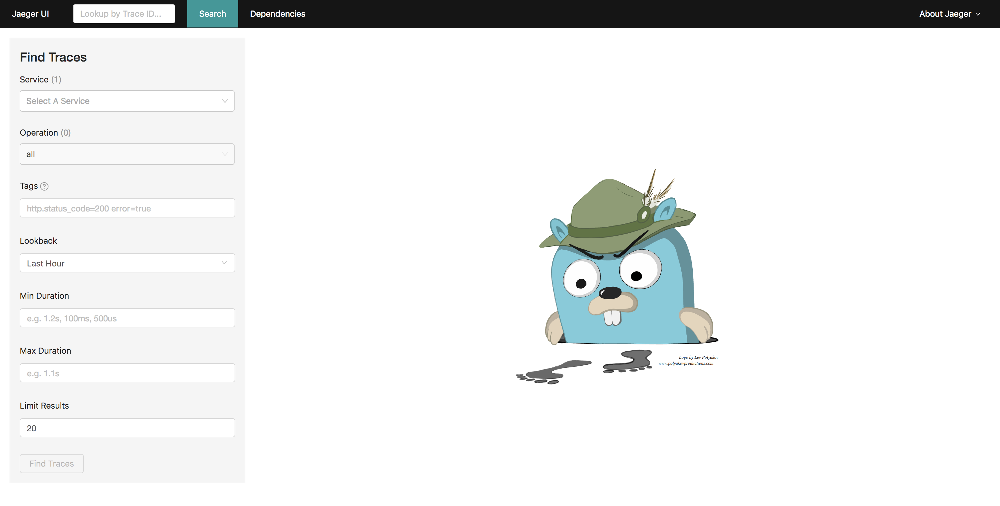

# Istio05: Observability - Distributed Tracing

<!-- TOC -->
- [Istio05: Observability - Distributed Tracing](#istio05-observability---distributed-tracing)
  - [View Traces](#view-traces)


The sample Bookinfo application is configured to collect trace spans using Zipkin or Jaeger. Although Istio proxies are able to automatically send spans, it needs help from the application to tie together the entire trace. To do this applications need to propagate the appropriate HTTP headers so that when the proxies send span information to Zipkin or Jaeger, the spans can be correlated correctly into a single trace.

To do this the application collects and propagates the following headers from the incoming request to any outgoing requests:

- `x-request-id`
- `x-b3-traceid`
- `x-b3-spanid`
- `x-b3-parentspanid`
- `x-b3-sampled`
- `x-b3-flags`
- `x-ot-span-context`


## View Traces

If you have not set `GATEWAY_URL` environment variable, please do so by following [Module Istio04](istio-04-telemetry.md).

Now, let us generate a small load on the sample app by using [fortio](https://github.com/istio/fortio):

```sh
docker run istio/fortio load -t 5m -qps 5 http://$GATEWAY_URL/productpage
```

Let us forward local port to Jaeger-UI and access to the Jaeger UI by running the following command:
```sh
# One Terminal
kubectl port-forward -n istio-system $(kubectl get pod -n istio-system -l app=jaeger -o jsonpath='{.items[0].metadata.name}') 16686:16686

# Another Terminal
open http://localhost:16686
```

You can click on the link at the top of the page which maps to the right port and it will open Jaeger UI in a new tab.




---
[Istio Top](aks-202-istio-top.md)| [Back](istio-04-telemetry.md) | [Next](istio-06-routing-canary-testing.md)